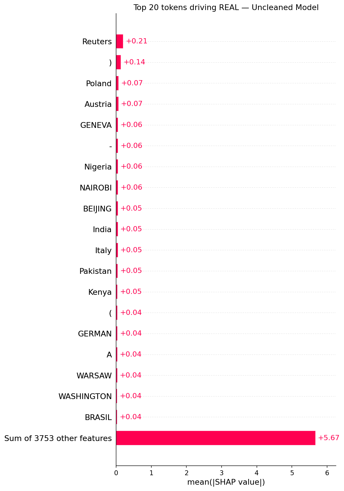
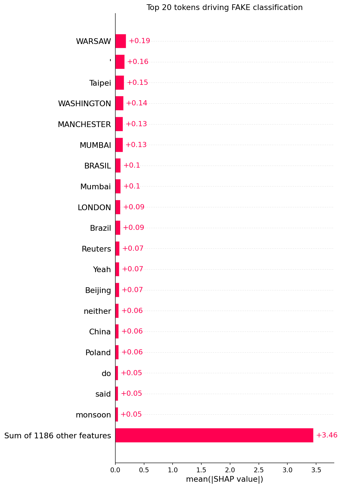
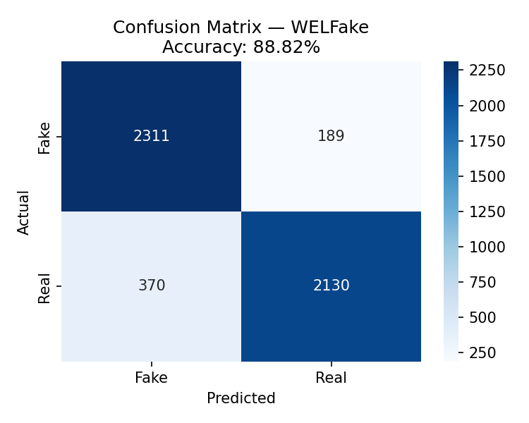

# Fake News Detection with DistilBERT

**A complete NLP pipeline for binary fake news classification** — featuring SHAP-based data leakage detection, regex cleaning, and cross-dataset generalization validation.

Built for IS6423 (Machine Learning for Business) at City University of Hong Kong.

---

## The core finding: diagnosing and fixing data leakage

Initial training produced **99.91% accuracy after just 1 Epoch** — suspiciously high. Rather than accepting the result, SHAP (SHapley Additive Explanations) was applied to 100 samples to audit what the model had actually learned.

### What SHAP revealed (uncleaned model)



**Reuters** dominated the REAL class with a SHAP value of +0.21 — more than **3× higher than the second feature**. The model was detecting Reuters wire service byline markers (`WASHINGTON (Reuters) —`) rather than learning genuine linguistic patterns. This is classic data leakage.

### After cleaning

All institutional byline markers were removed via regex. Input was restructured as `title + [SEP] + first 100 words`.

| Feature | Before cleaning | After cleaning |
|---|---|---|
| Top REAL signal | Reuters (+0.21) | WARSAW, GENEVA, geographic datelines |
| Top FAKE signal | Video, Twitter | Yeah, Surely, colloquial expressions |
| Interpretation | Formatting artifact | Genuine writing style difference |

Post-cleaning SHAP for FAKE classification — model now relies on informal language patterns:



---

## Results

### ISOT dataset (44,898 samples)

| Run | Accuracy | F1 | Notes |
|---|---|---|---|
| Uncleaned (1 epoch) | 99.91% | 0.9991 | Data leakage |
| Cleaned (3 epochs) | **99.98%** | **0.9998** | Genuine learning |

Training config: 3 epochs · batch size 16 · LR 2e-5 · AdamW · Google Colab T4 GPU · ~42 min

### Cross-dataset validation — WELFake (zero-shot)

Tested on 5,000 samples (stratified) from WELFake, a separate dataset aggregating 4 different sources. Model was **not retrained** — pure zero-shot transfer.



**88.82% accuracy** on an unseen dataset confirms the model learned real linguistic style differences, not dataset-specific artifacts.

| Dataset | Samples | Accuracy | F1 |
|---|---|---|---|
| ISOT (post-cleaning) | 44,898 | 99.98% | 0.9998 |
| WELFake (zero-shot) | 5,000 | **88.82%** | 0.8881 |

---

## Architecture choice: why DistilBERT over TF-IDF

| Aspect | TF-IDF + Classifier | DistilBERT |
|---|---|---|
| Semantic understanding | Bag-of-words only | Contextual embeddings |
| Speed vs BERT | — | 60% faster inference |
| Parameters vs BERT | — | 40% fewer |
| NLU retention | — | 97% of BERT's capability |
| Accuracy ceiling (LSTM baseline) | ~97.9% | **99.98%** |

---

## Repository structure

```
├── notebooks/
│   ├── Training.ipynb               # Model training — 3 epochs, AdamW, T4 GPU
│   ├── SHAP.ipynb                   # SHAP analysis — leakage detection & post-clean audit
│   └── Cross-dataset validation.ipynb  # Zero-shot WELFake evaluation
├── assets/
│   ├── shap_real_uncleaned.png      # Reuters dominance (leakage evidence)
│   ├── shap_fake.png                # Post-clean FAKE signal analysis
│   └── cm_WELFake.png              # Cross-dataset confusion matrix
└── README.md
```

---

## Data

This project uses two public datasets — not included in this repo due to size:

- **ISOT Fake News Dataset** — [University of Victoria](https://www.uvic.ca/ecs/ece/isot/datasets/fake-news/index.php) (44,898 articles)
- **WELFake Dataset** — [Kaggle](https://www.kaggle.com/datasets/saurabhshahane/fake-news-classification) (72,134 articles, 4 sources)

---

## Limitations

The model is a **writing style classifier, not a fact-checker**. A well-written fake article can fool it. The ~11% accuracy drop on WELFake indicates domain shift — both datasets were balanced 50/50, which doesn't reflect real-world fake news prevalence.

---

## Tech stack

`Python` · `PyTorch` · `Transformers (HuggingFace)` · `SHAP` · `scikit-learn` · `Google Colab`
